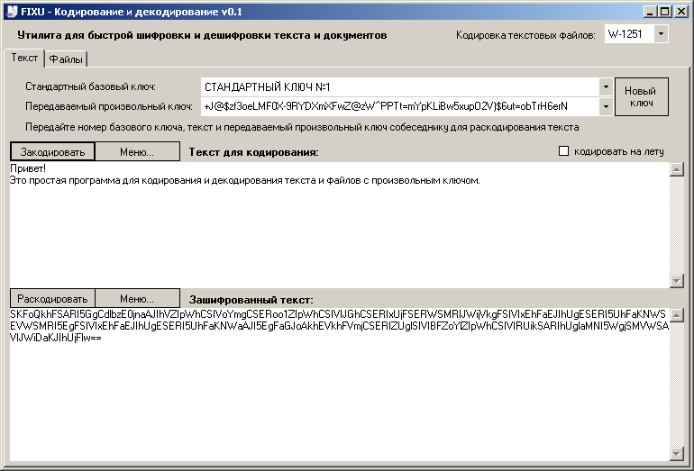
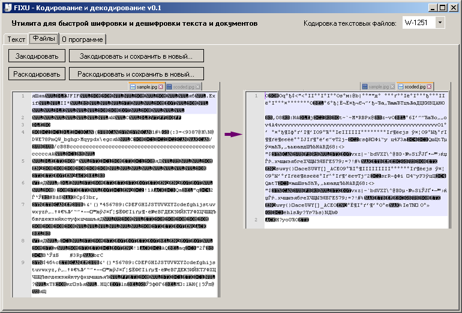
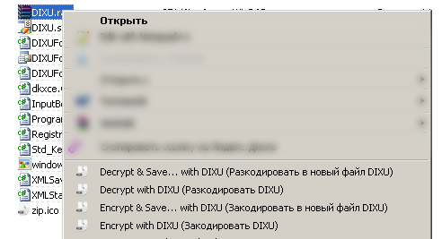
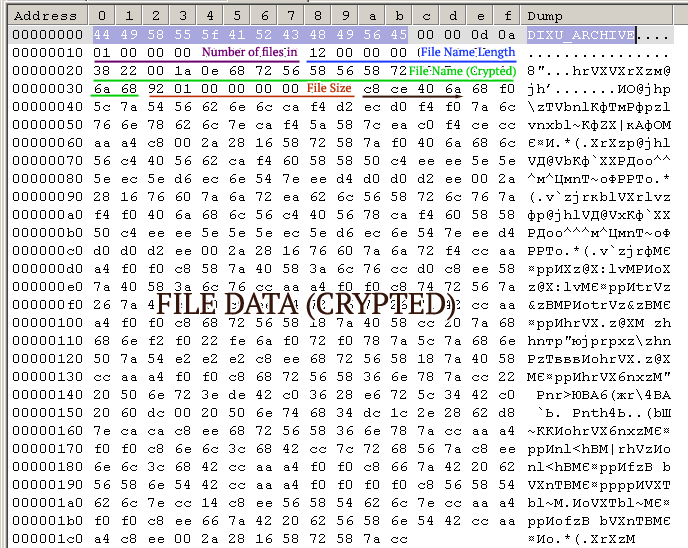

# DIXU

**dixu** v0.1 - dkxce simple opensource free symmetric crypt algorythm (UTF8, ASCII, Win-1251)

**dixu** v0.1 - легковесная (один единственный exe'шник 96КБ или архив 28КБ для версии min), простая, надежная и бесплатная с открытым исходным кодом программа для шифрования и дешифрования текста и любых файлов с возможностью объединять исходные файлы в однофайловый архив. Программа при шифровании файлов не меняет их размер. Степень защиты данных определяется длинной базового ключа (по умолчанию 512 бит) и длиной передаваемого ключа (чем длиннее, тем надежнее).

**[Скачать exe'шник можно здесь](https://github.com/dkxce/DIXU/releases/tag/dixuv0.1)** - Windows XP SP3 и выше

    
    
    

**DIXU [Algorythm](dkxce.Crypt.DIXU.cs)**:
 
   **Crypt**:  
   
       // op - byte to encrypt
       // initial_key = 512-bit (64 bytes) initial key
       // shared_key  = nonzero-length shared key
       
       for (j = 0; j < initial_key.Length; j++)
          op = (op << (initial_key[j] & 0x07)) ^ initial_key[j];
          
       for (j = 0; j < shared_key.Length; j++)
          op = (op << (j % 7 + 1)) ^ shared_key[j];
          
   **Decrypt**:    
   
       // op - byte to decrypt
       // initial_key = 512-bit (64 bytes) initial key
       // shared_key  = nonzero-length shared key
       
       for (j = shared_key.Length - 1; j >= 0; j--)
          op = (op ^ shared_key[j]) >> (j % 7 + 1);
          
       for (j = initial_key.Length - 1; j >= 0; j--)
          op = (op ^ initial_key[j]) >> (initial_key[j] & 0x07);
   
**DIXU [Archive File Format .dxa](https://github.com/dkxce/DIXU/blob/main/DIXUForm.cs#L576)**:    

       00..15 Bytes - File Header "DIXU_ARCHIVE\0\0\r\n" (ASCII)
       NEXT 8 Bytes - File Records Counts (Int64)
       EACH FILE RECORD
           NEXT 8 Bytes - n, File Name Length (Int64)
           NEXT n Bytes - Relative File Name (Encoded UTF-8)
           NEXT 8 Bytes - m, File Data Length (Int64)
           NEXT m Bytes - File Data (Encoded)
       END

